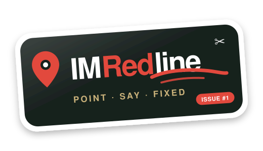
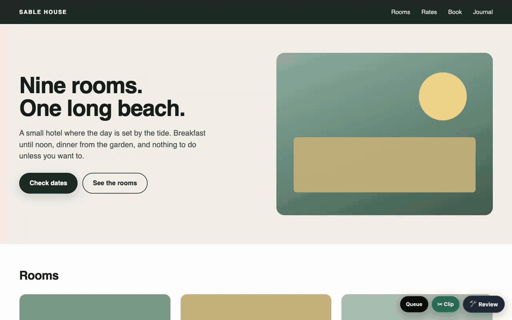
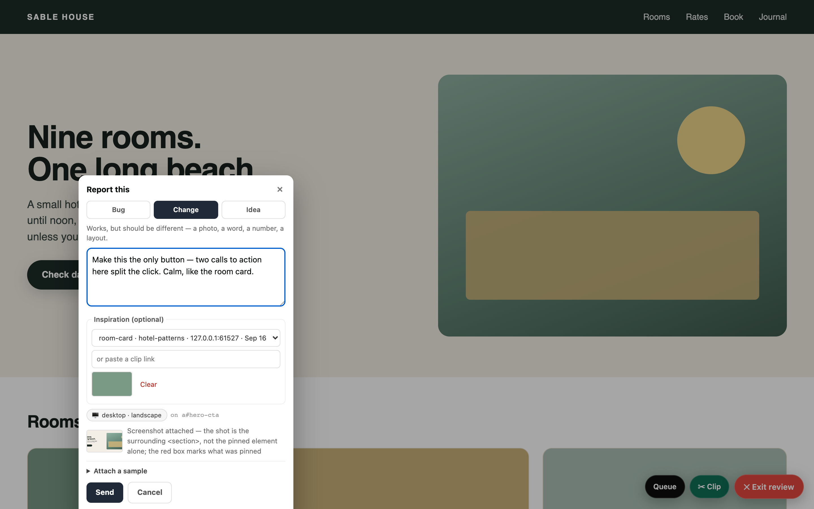
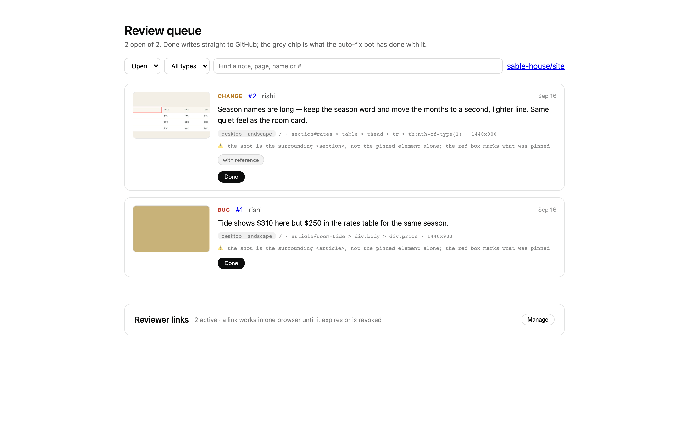
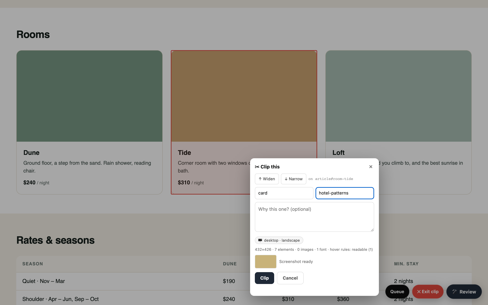
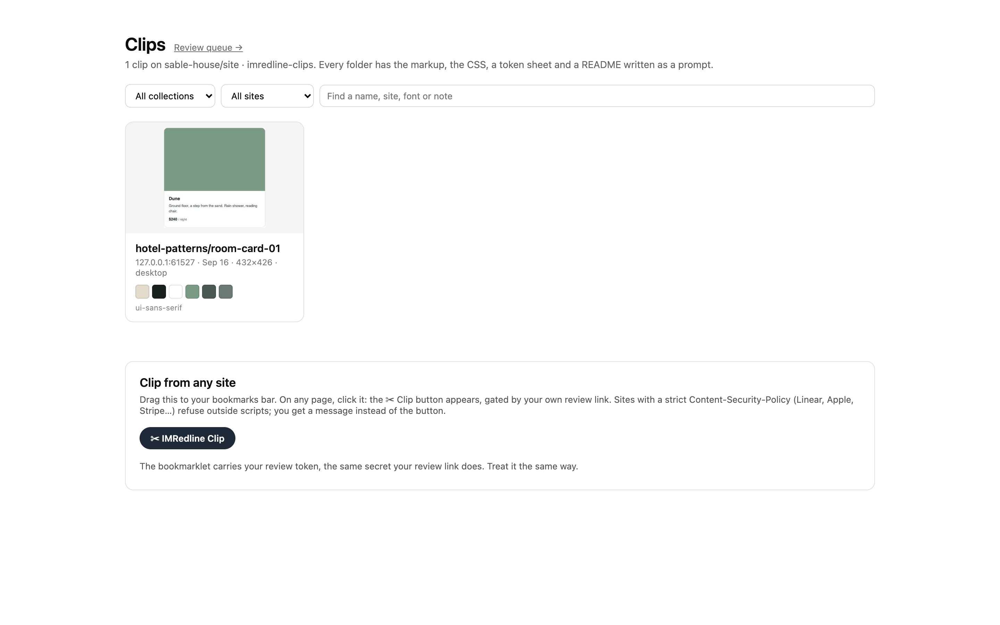
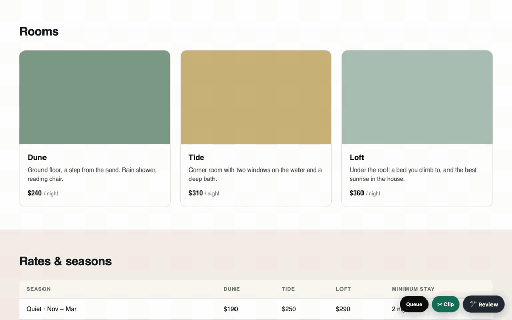
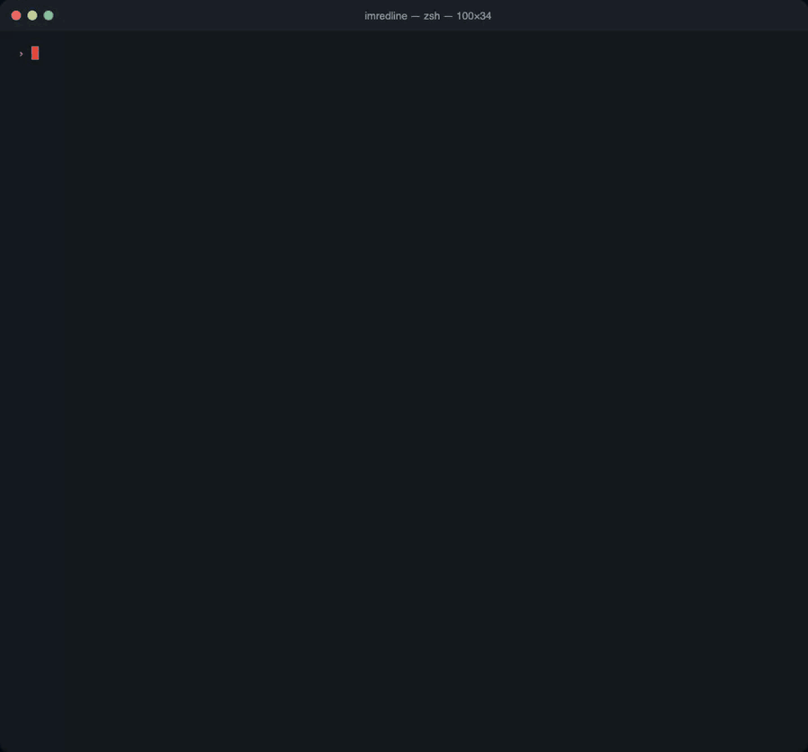

<p align="center">
  
</p>

# IMRedline

Point at anything on a live website, say what's wrong, and it lands as a GitHub issue — screenshot, pinned element, device, attachments and all — where a person or an AI agent picks it up and fixes it.

One package. Installs the same way on every site. Reviewers need no account. GitHub is the whole backend: Issues are the queue, labels are the status, an orphan branch holds the pictures. Nothing else to host.

<p align="center">
  
</p>

**Status:** 0.6.0 in this branch. The 0.5.x package is on npm (`npm i imredline`), running on five production sites (Nutrition Nest, EIPL Energy, PEMA Wellness, Aradea, Pebble Beach). The issue-body contract and the clip folder layout are frozen; the rest may still move before 1.0.

Community-supported. MIT.

## What a reviewer does

1. Opens the private link you give them once (`https://yoursite.com/?imredline=…`). A small **🛠 Review** button appears on every page, in that browser, until the link expires or is revoked.
2. Clicks Review, then clicks anything on the page. A dialog opens; the screenshot of that area is taken in the background with a red box on what they pinned.
3. Picks **Bug / Change / Idea**, writes a note, optionally attaches samples (paste or drop images, a link, a file path), checks the **phone / tablet / desktop** chip the widget guessed, and hits Send.
4. It becomes a GitHub issue labelled `tester-feedback`. Your queue at `/imredline/queue` shows it; so does GitHub.

## Install

```
npm install imredline
```

### Next.js (App Router)

```ts
// app/imredline/[[...path]]/route.ts
import { imredline } from "imredline/next";
export const dynamic = "force-dynamic";
export const { GET, POST, PATCH, DELETE, OPTIONS } = imredline();
```

```tsx
// app/layout.tsx — anywhere in <body>
<script src="/imredline/widget.js" defer />
```

Node runtime only (the handler uses `node:crypto` and `node:fs`).

### Plain Node `http`

```js
import { createNodeHandler } from "imredline/node";
const imredline = createNodeHandler();

http.createServer(async (req, res) => {
  if (await imredline(req, res)) return;   // handled everything under /imredline
  // …your routes
});
```

Add the same `<script src="/imredline/widget.js" defer>` to your pages.

### A site you don't host (Squarespace, an old CMS, a page behind GTM)

Run IMRedline on any Node host you do control, list the other site's origin, and drop one tag into that site (a GTM Custom HTML tag works):

```
IMREDLINE_ORIGINS=https://www.pebblebeachvizag.com
```

```html
<script src="https://your-imredline-host.com/imredline/widget.js" defer
        data-host="https://your-imredline-host.com"></script>
```

Reports carry `host/path` so the issue says which site they came from. The token lives in that site's `localStorage` and is re-validated on every page load.

## Configure

| Variable | Purpose |
|---|---|
| `IMREDLINE_ADMIN_TOKEN` | You. One link arms the widget **and** opens the queue. |
| `IMREDLINE_ADMIN_NAME` | Optional. Your name on reports (default `owner`). |
| `IMREDLINE_REVIEWERS` | `name:secret,name:secret` — reviewer links that never expire. |
| `IMREDLINE_GITHUB_TOKEN` | Fine-grained PAT with **Contents R/W + Issues R/W** on one repo. |
| `IMREDLINE_GITHUB_REPO` | `owner/repo` — the site's own repo. |
| `IMREDLINE_SITE` | Optional label → `site:<label>` on every issue. Useful when one repo takes several sites. |
| `IMREDLINE_ORIGINS` | Third-party origins allowed to post, comma-separated. Empty = same-origin only. |
| `IMREDLINE_DATA_DIR` | Where minted reviewer links (SHA-256 only) live. Default `.imredline`. On Railway, point it at a volume or minted links vanish on redeploy; env reviewers are unaffected. |
| `IMREDLINE_MASK_FORMS` | `1` blanks form fields in screenshots. Default off — testers need to see what they typed. Anything with `data-imredline-private` is always blanked. |
| `IMREDLINE_BASE` | Mount path. Default `/imredline`. |
| `IMREDLINE_CLIPS_REPO` | Optional `owner/repo` for clips (see below). Default: the reports repo. Same token; needs Contents R/W there. |
| `IMREDLINE_CLIP_ORIGINS` | `*` lets the bookmarklet clip from **any** site. Off by default. Reports are never affected. |

Without the GitHub variables every write returns 503 and the widget says so. It ships dormant and loud, never silently dropping reports.

## In pictures

| A report being written | The queue |
|---|---|
|  |  |

| ✂ Clip a component | The clips gallery |
|---|---|
|  |  |

Every picture above comes from `npm run media`: the real widget on the demo page in `docs/demo/`, against an in-memory GitHub. Run it to regenerate them after a UI change.

## The queue

`/imredline/queue?token=<admin token>` once; after that the bare URL works in that browser. Any reviewer can open it too — through the **Queue** button on the widget, or with their own link's token — and sees every report and screenshot **read-only**. Open / Done is the issue's open / closed state — one call, nothing can half-apply; only the admin can flip it. The grey chip is whatever an auto-fix bot has labelled the issue (`triaged:ok`, `pr-open`, `merged`, `deployed`, `implement-failed`…); IMRedline only reads those labels, never writes them.

**Reviewer links** are minted there: name, how long the link lasts (1–90 days), optionally which site it may report on. The link is shown once; only its hash is stored. Revoke takes effect on that browser's next page load.

## Clip — components for inspiration

The bar has a second button: **✂ Clip**. Same point-and-click, but nothing is filed. The component you pick lands on the `imredline-clips` branch as a folder any person or coding agent can rebuild from:

<p align="center">
  
</p>


```
clips/<collection>/<name>-NN/
  README.md        a prompt: source, size, tokens table, assets, how to rebuild
  component.html   the markup, cleaned — no scripts, no tracking attributes, classes rewritten to .c1 .c2 …
  component.css    computed styles folded into those classes (40–150 lines, not the site's framework),
                   then hover/focus/active rules and keyframes where the browser could read them
  tokens.json      colours (with contrast), fonts, type scale, spacing, radii, shadows, breakpoints
  meta.json        source URL, viewport, device, counts, widget version
  preview.html     html + css in one file — open it
  screenshot.jpg   what it looked like
clips/index.json   every clip, newest first
```

**Widen / Narrow** (or ↑ ↓) walk up and down the DOM, because the thing you mean is usually the parent of what you clicked. The dialog says what it has: `1360×1494 · 27 elements · 6 images · 2 fonts · hover rules: readable (3)`. Over 400 elements or 200 KB it refuses and says so.

Sizing comes from the cascade, not the used pixels: `width: 90%` stays `90%`, `grid-cols-3` stays `repeat(3, minmax(0, 1fr))`. Cross-origin stylesheets cannot be read; the clip then says `states: partial`, the resting look is still complete, and sizes fall back to heuristics.

Nothing is fetched by the server and no image or font bytes are copied — the README lists their addresses and says *download if you have the right to*. Only the screenshot travels. Text is kept so the layout reads; the README says whose it is.

**The gallery** at `/imredline/clips` — cards with screenshot, swatches and fonts; filter by collection or site; open one for the README, the preview in a sandboxed iframe, and Copy prompt / HTML / CSS / tokens. Read-only for every reviewer, like the queue.

**Any site.** With `IMREDLINE_CLIP_ORIGINS=*` the gallery offers a bookmarklet. On a page that does not carry the widget, it injects it with your own token; the ✂ button appears and the clip lands in the same branch. A strict Content-Security-Policy (Linear, Apple, Stripe…) refuses the script; the bookmarklet says so instead of failing silently. For those sites, `skills/imredline-clip` clips by address from the owner's machine: a headless Chrome that ignores the page's CSP injects the same widget and sends the same clip. A page that already runs IMRedline ignores the bookmarklet (its own widget wins).

One clip is one commit. A coding agent building a new site reads the branch — `clips/index.json` first, then the folder.

**Report with inspiration.** Clip first, then press **🛠 Review** on the site you want to change. Under the note, choose one of the latest 20 clips or paste a gallery link from the clip toast's **Copy link** button. The thumbnail shows your choice; **Clear** removes it. Send carries the reference into the issue, and the queue shows a **with reference** chip, thumbnail and folder link. Inspiration is optional: rebuild the idea with your own words, images and brand.

**The audit half** is a skill for your own Claude Code, not package code: [`skills/imredline-audit`](skills/imredline-audit/SKILL.md). `/imredline-audit clips/<collection>/<slug>` runs the mechanical checks (contrast per text run on its real background, tap targets, type scale, spacing rhythm, heading order, copy length, motion without `prefers-reduced-motion`, missing focus styles, image alt and sizing, palette sprawl, div-soup), looks at the screenshot, and writes `audit.md` into the folder — fixes before reuse, what to steal, facts checked. The gallery shows an **audited** chip and the audit under the README. With `--issues` it files one `tester-feedback` issue per fix on the site's repo, in the same body contract as a report. Install: symlink that folder into `~/.claude/skills/`. A worked example is on this repo's own `imredline-clips` branch: `clips/inbox/main-part-01`.

## Fix the review queue from a terminal

Reports are plain GitHub issues, so any coding agent can work them. The repo ships a skill for Claude Code that makes it one sentence: **"Fix the review queue."** It lists the open reports, opens each screenshot, finds the element in the code, makes one commit per report, runs the repo's checks, ships the way the repo ships, and closes each issue with the commit in a comment. When a report carries inspiration (a clip the reviewer picked in the dialog), the skill reads that clip's README, CSS and screenshot and rebuilds the idea in the site's own words and brand — never the source's text, images or code.

<p align="center">
  
</p>

That recording is a real run in this repo (issues #1 and #2, commits `48cb815` and `0bc4f8f`), condensed. Install: symlink [`skills/imredline-fix`](skills/imredline-fix/SKILL.md) into `~/.claude/skills/` (or `node_modules/imredline/skills/imredline-fix` from a project that has the package). **Codex** users paste the skill's Steps and Rules into `AGENTS.md`; the helper script is the same. The skill never touches reports another agent holds (`pr-open`, `fixing`) or ones marked `needs-owner`.

## The issue body is a contract

```
<!-- imredline:<uuid> -->
**CHANGE** reported from the site.

> the reviewer's note, one line

<details><summary>context</summary>

- **reviewer:** Asha
- **page:** `/rooms`
- **element:** `section#rooms > img#room-img`
- **viewport:** 390x844 @3x
- **device:** phone · portrait · touch
- **inspiration:** `clips/ideas/hero-01`

</details>

📷 `shots/2026-09-13T10-00-00-000Z-Asha.jpg` on `imredline-assets` — renders on the queue.

📎 inspiration: https://yoursite.com/imredline/clips?clip=clips/ideas/hero-01  — folder: https://github.com/owner/repo/tree/imredline-clips/clips/ideas/hero-01
> Inspiration only. Rebuild the idea with this site's own words, images and brand. Do not copy the source's text, images, logos, animation files or code.

**Samples to guide this change**

🖼 `samples/…-1.jpg` on `imredline-assets` — sample image "reference.png"
🔗 sample link supplied by the reviewer — a reference, not fetched:
```text
https://…
```
```

The optional `**inspiration:**` line adds `(owner/repo)` when the clip is in another repo. The 📎 block links to the gallery and folder; without a gallery URL its first value is `—`. Old reports have no inspiration reference.

Fields never move; new ones are added as new lines. An agent that reads the issue gets: the exact element, the screen size and **which kind of device** to look at, the picture on the assets branch, and the reviewer's samples. The note and every link or path are quoted as text — a report is context, not permission to change code.

The UUID on the first line makes a retry safe: a Send that timed out but landed is found, not filed twice.

## Marking up your site (optional)

| Attribute | Effect |
|---|---|
| `data-imredline-frame` | "Photograph this box when anything inside it is pinned" — for sticky scroll stages whose nearest landmark is the whole page. |
| `data-imredline-stack` | Children are stacked, scroll-faded siblings; pin the one actually visible, not the transparent one on top. |
| `data-imredline-animated` | Bake this element's current animation frame into the screenshot. |
| `data-imredline-private` | Always blanked in screenshots, whatever the masking switch says. |
| `data-imredline-ui` | Never photographed, never pickable. The widget's own chrome uses it. |

## What it does not do (yet)

- **Store anything itself.** If GitHub is down, Send shows a clear error and keeps the draft in the dialog; the reviewer tries again. A database-backed queue that never loses a report is v2.
- **Delete pictures.** They are commits on the `imredline-assets` branch; git keeps them. If that matters, keep the repo private (the queue warns when it isn't).
- **Native apps.** IMRedline needs a DOM. An iOS / Android SDK that files into the same issue format is a separate future project.
- **Audit a clip.** Capturing is the package's job; judging is yours. A UX-audit skill for your own Claude that reads the clip folder is the intended next step (see `docs/CLIP-SPEC.md`), and a journey recorder across pages is v2.

## Develop

```
npm run build          # tsc + esbuild bundles + baked assets
npm run test:unit      # node --test (26)
npm run test:browser   # render-and-look in system Chrome: capture fixture (13) + full widget e2e (40)
```

The browser tests write pictures to `test/output/`. Open them. No unit test can tell a wrong screenshot from a right one.

## Support and contributing

Community-supported: no company, no SLA. Issues and pull requests are read when
there is time. See [CONTRIBUTING.md](CONTRIBUTING.md) for how to run the tests,
what is welcome, and what is frozen (the issue-body contract, the mount path,
the env names). Security reports go through GitHub's private vulnerability
reporting, not a public issue.
